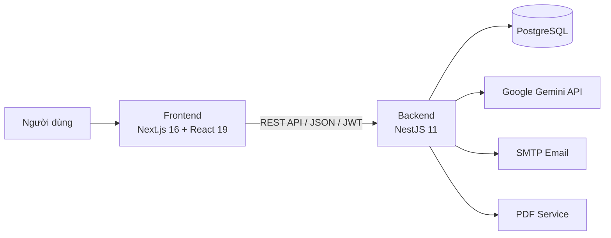

# MealAI - Hệ thống gợi ý thực đơn và nấu ăn cho gia đình tích hợp AI

MealAI là đồ án tốt nghiệp xây dựng một hệ thống web hỗ trợ gia đình quản lý công thức, nguyên liệu, thực đơn, danh sách mua sắm và dinh dưỡng. Hệ thống kết hợp Recommendation Engine với Google Gemini để cá nhân hóa món ăn theo hồ sơ sức khỏe, dị ứng, sở thích, nguyên liệu hiện có và mục tiêu năng lượng của người dùng.

## 1. Thông tin đồ án

- **Tên đề tài:** Xây dựng hệ thống gợi ý lập thực đơn và nấu ăn cho gia đình tích hợp AI
- **Tên hệ thống:** MealAI
- **Sinh viên thực hiện:** Nguyễn Nhựt Hóa
- **MSSV:** 110122006
- **Lớp:** DA22TTA

## 2. Mục tiêu

Đồ án hướng đến các mục tiêu:

- Giảm thời gian lựa chọn món và lập kế hoạch ăn uống cho gia đình.
- Gợi ý món ăn phù hợp với số người ăn, dị ứng, bệnh lý, chế độ ăn và sở thích.
- Tận dụng nguyên liệu đang có hoặc sắp hết hạn nhằm hạn chế lãng phí thực phẩm.
- Theo dõi calories, protein, carbohydrate và chất béo so với mục tiêu TDEE.
- Tự động tổng hợp nguyên liệu còn thiếu để tạo danh sách mua sắm.
- Cho phép người dùng điều khiển các nghiệp vụ chính bằng chatbot tiếng Việt.

## 3. Chức năng chính

### Người dùng

- Đăng ký, đăng nhập, làm mới token và khôi phục mật khẩu qua email.
- Quản lý hồ sơ cá nhân, chỉ số cơ thể, mức vận động, dị ứng, bệnh lý và số người ăn.
- Xem, tìm kiếm, lọc, yêu thích, đánh giá, bình luận và đóng góp công thức.
- Quản lý nguyên liệu trong tủ lạnh theo số lượng, đơn vị và hạn sử dụng.
- Lập thực đơn theo ngày hoặc tuần; thêm, đổi, xóa và khóa món.
- AI gợi ý món với tùy chọn ưu tiên món mới và tránh lặp món trong 7 ngày.
- Hiển thị tổng calories từng bữa, từng ngày và so sánh với mục tiêu từ TDEE.
- Tạo danh sách mua sắm, trừ nguyên liệu sẵn có theo nguyên tắc FEFO và đánh dấu đã mua.
- Xuất thực đơn hoặc danh sách mua sắm ra PDF; chia sẻ danh sách mua sắm.
- Theo dõi biểu đồ dinh dưỡng và AI Insights theo tuần.
- Sử dụng chatbot để tìm món, quản lý tủ lạnh, thực đơn và danh sách mua sắm.

### Quản trị viên

- Quản lý tài khoản người dùng.
- Quản lý và kiểm duyệt công thức do người dùng gửi.
- Xem AI Review và AI Score để hỗ trợ kiểm duyệt công thức.
- Quản lý đánh giá, bình luận vi phạm và thông báo quản trị.

## 4. Kiến trúc hệ thống

MealAI sử dụng kiến trúc client-server ba lớp:



### Frontend

- Next.js App Router chịu trách nhiệm định tuyến và hiển thị giao diện.
- React Context và Local Storage hỗ trợ quản lý phiên đăng nhập.
- Axios gọi REST API với tiền tố `/api/v1`.
- Chart.js hiển thị biểu đồ dinh dưỡng.

### Backend

- NestJS tổ chức nghiệp vụ theo module.
- Passport JWT và bcryptjs đảm nhiệm xác thực, phân quyền và bảo mật mật khẩu.
- TypeORM ánh xạ entity và truy cập PostgreSQL.
- Recommendation Engine lọc và chấm điểm công thức.
- Chatbot kết hợp parser tiếng Việt, action handler, function calling và Gemini API.

### Recommendation Engine

Quy trình gợi ý gồm ba giai đoạn:

1. **Lọc sơ bộ:** loại món không phù hợp với dị ứng, bệnh lý, chế độ ăn, thời gian nấu hoặc bữa ăn.
2. **Chấm điểm:** kết hợp Nutrition/Health, Ingredient Match, Waste Reduction, Preference, Cook Time, Meal Calories Fit và Day Calories Fit.
3. **Điều chỉnh kết quả:** hạn chế trùng món, ưu tiên món mới, áp dụng điểm phạt món vừa xuất hiện và fallback khi kho công thức ít.

### Triển khai

- **Frontend:** Vercel
- **Backend:** Render Web Service
- **Cơ sở dữ liệu:** Render PostgreSQL
- File [`render.yaml`](./render.yaml) chứa Blueprint triển khai backend, database và một frontend tùy chọn trên Render.

## 5. Cấu trúc thư mục

```text
recipe_AI/
|-- frontend/                 # Next.js, React, TypeScript, Tailwind CSS
|   |-- src/app/              # Các trang theo App Router
|   |-- src/components/       # Component dùng chung và ChatWidget
|   |-- src/context/          # AuthContext
|   `-- src/lib/              # API client và helper
|-- backend/                  # NestJS, TypeORM, PostgreSQL
|   |-- src/modules/auth/     # Xác thực và hồ sơ người dùng
|   |-- src/modules/recipes/  # Công thức, yêu thích, đánh giá, kiểm duyệt
|   |-- src/modules/inventory/
|   |-- src/modules/recommendation/
|   |-- src/modules/meal-plan/
|   |-- src/modules/shopping-list/
|   |-- src/modules/chatbot/
|   |-- src/modules/notification/
|   `-- src/modules/pdf/
|-- assets/                   # Tài nguyên của đồ án
|-- render.yaml               # Cấu hình triển khai Render
`-- README.md
```

## 6. Phần mềm cần thiết

Để chạy dự án trên máy cá nhân cần cài đặt:

| Phần mềm | Phiên bản khuyến nghị | Mục đích |
| --- | --- | --- |
| Git | Bản ổn định mới | Tải và quản lý mã nguồn |
| Node.js | 22.x | Chạy frontend và backend |
| npm | 10.x trở lên | Cài đặt thư viện |
| PostgreSQL | 14 trở lên | Lưu trữ dữ liệu |
| Visual Studio Code | Tùy chọn | Chỉnh sửa mã nguồn |
| pgAdmin 4 | Tùy chọn | Quản lý PostgreSQL bằng giao diện |

Các dịch vụ ngoài:

- **Google Gemini API:** cần thiết để dùng đầy đủ chatbot và AI Review. Nếu chưa cấu hình, một số chức năng dùng chế độ fallback.
- **SMTP/Gmail App Password:** cần thiết để gửi email quên mật khẩu.

## 7. Cài đặt và chạy chương trình

### Bước 1: Tải mã nguồn

```bash
git clone https://github.com/nhuthoas04/tn-da22tta-nguyennhuthoa-meal-ai.git
cd tn-da22tta-nguyennhuthoa-meal-ai
```

### Bước 2: Tạo cơ sở dữ liệu PostgreSQL

Ví dụ bằng `psql`:

```sql
CREATE DATABASE recipe_ai;
```

Có thể tạo database bằng pgAdmin 4 với tên `recipe_ai`.

### Bước 3: Cấu hình backend

Tạo file `backend/.env`:

```env
NODE_ENV=development
PORT=3001

# PostgreSQL local
DB_HOST=localhost
DB_PORT=5432
DB_USERNAME=postgres
DB_PASSWORD=your_postgres_password
DB_NAME=recipe_ai
DB_SSL=false
DB_SYNC=true

# JWT
JWT_SECRET=replace_with_a_long_random_secret
JWT_REFRESH_SECRET=replace_with_another_long_random_secret
JWT_EXPIRES_IN=1d
JWT_REFRESH_EXPIRES_IN=7d

# Google Gemini
GEMINI_API_KEY=your_gemini_api_key

# Email qua Resend HTTP API
RESEND_API_KEY=re_xxxxxxxxx
EMAIL_FROM=MealAI <onboarding@resend.dev>
EMAIL_DEBUG=false

# Frontend và CORS
FRONTEND_URL=http://localhost:3000
CORS_ORIGIN=http://localhost:3000
```

Lưu ý:

- Không commit `.env`, API key hoặc mật khẩu database lên GitHub.
- `DB_SYNC=true` giúp tạo/cập nhật bảng khi phát triển. Cần sao lưu dữ liệu trước khi thay đổi schema trên môi trường production.
- Khi database còn trống, `SeedService` tự tạo dữ liệu nguyên liệu và công thức mẫu ở lần khởi động đầu tiên.

Khởi chạy backend:

```bash
cd backend
npm ci
npm run start:dev
```

Backend chạy tại:

```text
http://localhost:3001/api/v1
```

Kiểm tra trạng thái:

```text
http://localhost:3001/api/v1/health
```

### Bước 4: Cấu hình frontend

Mở terminal mới, tạo file `frontend/.env.local`:

```env
NEXT_PUBLIC_API_URL=http://localhost:3001/api/v1
```

Khởi chạy frontend:

```bash
cd frontend
npm ci
npm run dev
```

Truy cập:

```text
http://localhost:3000
```

## 8. Tài khoản và dữ liệu mẫu

Ở lần chạy đầu tiên với database trống, backend tự động seed danh mục nguyên liệu, công thức món Việt và tài khoản quản trị mẫu. Trước khi triển khai công khai, cần đăng nhập và thay đổi mật khẩu quản trị mặc định trong mã seed hoặc tạo thông tin quản trị riêng.

Người dùng thông thường có thể tạo tài khoản tại:

```text
http://localhost:3000/register
```

## 9. Kiểm tra và build

### Backend

```bash
cd backend
npm test
npm run build
```

Chạy production sau khi build:

```bash
npm run start:prod
```

### Frontend

```bash
cd frontend
npm run lint
npm run build
npm run start
```

## 10. Triển khai

### Backend và PostgreSQL trên Render

1. Kết nối repository GitHub với Render.
2. Chọn **Blueprint** và trỏ đến file `render.yaml`.
3. Nhập các biến bí mật được đánh dấu `sync: false`, đặc biệt:
   - `GEMINI_API_KEY`
   - `RESEND_API_KEY`
4. Sau khi backend hoạt động, kiểm tra `/api/v1/health`.

### Frontend trên Vercel

1. Import repository vào Vercel.
2. Chọn **Root Directory** là `frontend`.
3. Framework Preset chọn **Next.js**.
4. Thêm biến:

```env
NEXT_PUBLIC_API_URL=https://<backend-render-domain>/api/v1
```

5. Deploy frontend.
6. Cập nhật `FRONTEND_URL` và `CORS_ORIGIN` của backend bằng domain Vercel rồi deploy lại backend.

## 11. Một số lỗi thường gặp

### Frontend báo không kết nối được backend

- Kiểm tra backend đã chạy ở cổng `3001`.
- Kiểm tra `NEXT_PUBLIC_API_URL`.
- Kiểm tra `CORS_ORIGIN` và `FRONTEND_URL`.
- Sau khi đổi biến môi trường trên Vercel, cần redeploy frontend.

### Backend không kết nối PostgreSQL

- Kiểm tra PostgreSQL đang chạy.
- Kiểm tra tên database, username, password và port.
- Với Render, dùng `DATABASE_URL` do Render cung cấp và bật `DB_SSL=true`.

### Không nhận được email đặt lại mật khẩu

- Kiểm tra `RESEND_API_KEY` và `EMAIL_FROM`.
- `onboarding@resend.dev` phù hợp để kiểm thử và có thể chỉ gửi tới email của
  tài khoản Resend. Muốn gửi cho người dùng thật, cần xác minh domain trong
  Resend rồi cập nhật `EMAIL_FROM`.
- Backend dùng Resend HTTP API nên không phụ thuộc các cổng SMTP bị chặn trên
  Render Free.
- Chỉ bật `EMAIL_DEBUG=true` khi kiểm thử. Liên kết đặt lại mật khẩu sẽ xuất
  hiện trong log backend.

### Chatbot không gọi Gemini

- Kiểm tra `GEMINI_API_KEY`.
- Xem log backend để biết hệ thống đang dùng Gemini hay fallback parser.

## 12. Bảo mật

- Không đưa file `.env` hoặc secret lên repository.
- Sử dụng JWT secret dài và khác nhau cho access token/refresh token.
- Đổi mật khẩu tài khoản quản trị mẫu trước khi triển khai.
- Chỉ cho phép các domain frontend hợp lệ trong `CORS_ORIGIN`.
- Sao lưu PostgreSQL định kỳ trước khi thay đổi schema hoặc restore dữ liệu.

## 13. Tác giả

**Nguyễn Nhựt Hóa**

Sinh viên lớp DA22TTA

Đại học Trà Vinh
